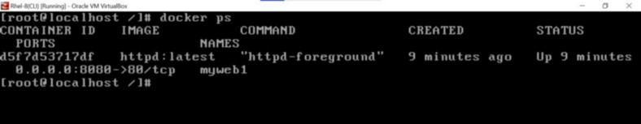

# ***Automating Docker Using Ansible Playbook***
<i><b>
> Ansible is a powerful automation tool meant for configuration management. In ansible we need to give the instructions regarding the requirement form the controller node to the managed node. To give these instructions we can use Ad-hoc command or we can use the ansible playbooks in which multiple plays can be present.

Here we are going to create a playbook for Configuring the web server on top of docker with the docker host as our managed node.

### ***Task Description:***

#### Write an Ansible Play Book that does the following operations in the managed nodes:
🔹 Configure Docker  
🔹 Start and enable Docker services  
🔹 Pull the httpd server image from the Docker Hub  
🔹 Run the docker container and expose it to the public  
🔹 Copy the html code in root directory
and start the web server  

### ***Requirements:***
1. Ansible setup over the controller node
2. Connectivity with the Managed node from controller node

### ***Let’s Begin …..***

1. For Telling to ansible which is our Manage node we need to put the info regarding the Manage node in the Inventory file. we can create an inventory file anywhere and tell the location of it in the ansible configuration file.

From this in my case I am going to use the ip’s mentioned in mysys group

2. Now we need to first configure the yum in the Managed node, install docker and then start + enable the docker services.

In the Above code we have used the Command module rather than the package module because with the package module we were unable to pass some critical options like — nobest and — skip-broken which were essential to install docker-ce. the only drawback of the command module is it do not have the idempotent nature so it will run the command even if the desired state is obtained

Now let’s check in the MN

3. Now we need to create a directory so that we can put our web pages in it and mount it with the container further when it is launched

here I have created a folder named fold_by_ansible in MN and put the index.html as a webpage in it having content as “hello this is web server configured by ansible”

Now let’s check in the MN

3. Now we need to launch the container mount it with the /fold_by ansible folder and expose the port 80 so that we can see the content from the outside world for this we used the module docker_container module the only requirement for this is the python3 and docker-py module in the MN so we also install those in the MN

Let’s Check our container is launched in the MN

Let’s try to connect it from the outside world (windows)

#### Great, we have successfully done the task. Hope You have Liked It

### ***Thankyou For Reading : )***

### ***Any query and suggestion are always welcome — [Gaurav Pagare](https://www.linkedin.com/in/pagare-gaurav/)***
